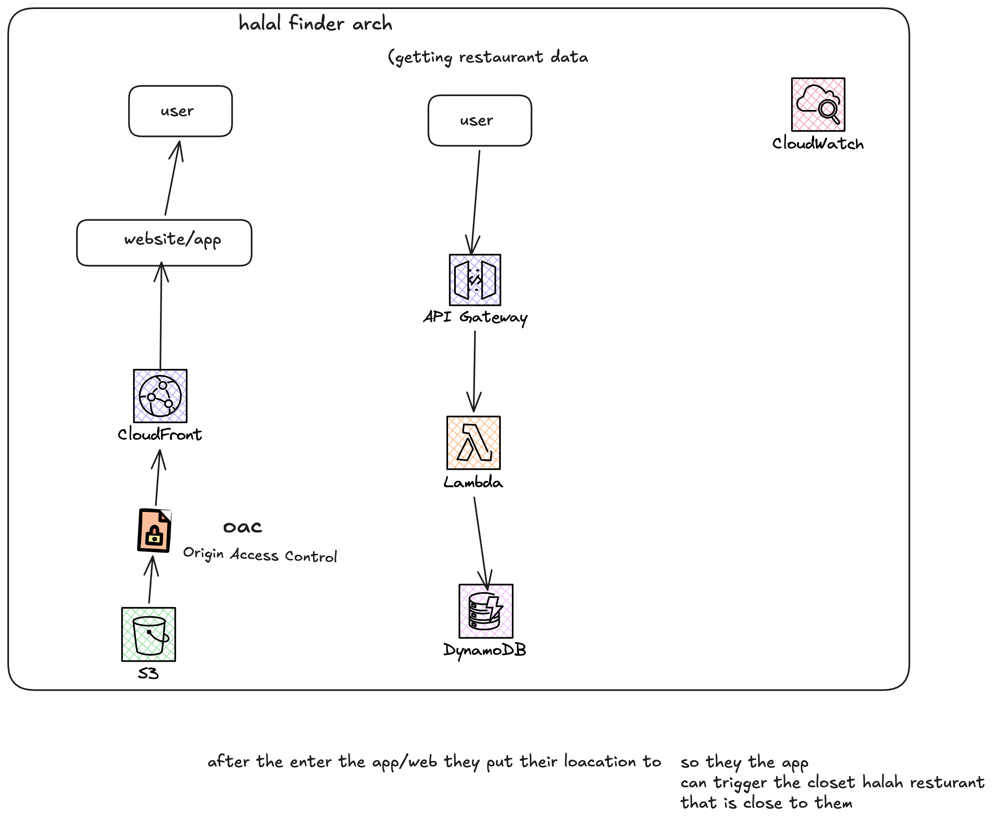

# 🕌 Halal Finder

A full-stack, serverless web app that helps people find halal restaurants and food trucks near them, using real-time GPS location — sorted by distance, shown on an interactive map.

**🔗 Live app:** https://d1e3ukex7mhofw.cloudfront.net

---

## The Problem

Finding halal food outside of well-known areas often relies on word of mouth. This app solves that with real-time location-based search — open it, allow location access, and see nearby halal spots sorted nearest to farthest.

---

## Architecture



There are two independent flows in this app:

**Flow A — Delivering the webpage**

User's browser -> CloudFront -> S3
The static Next.js site is stored in S3. CloudFront serves it globally with caching and free HTTPS.

**Flow B — Delivering restaurant data**
User's browser -> API Gateway -> Lambda -> DynamoDB
The browser sends the user's GPS coordinates to API Gateway, which triggers a Lambda function. Lambda reads all restaurants from DynamoDB, calculates distance from the user using the Haversine formula, sorts the results, and returns them as JSON.

---

## Tech Stack

| Layer | Technology | Why |
|---|---|---|
| Frontend | Next.js + Tailwind CSS | Static export, fast, no server needed |
| Map | Leaflet + OpenStreetMap | Free, no billing risk (unlike Google Maps) |
| Backend compute | AWS Lambda (Node.js) | Serverless — only runs (and costs) when invoked |
| API | AWS API Gateway | Public HTTP endpoint routing to Lambda |
| Database | AWS DynamoDB | Pay-per-request, no idle cost, simple key lookups |
| Hosting | AWS S3 + CloudFront | Static hosting + global CDN + free HTTPS |
| Infrastructure | Terraform | Infrastructure as Code — entire AWS environment is reproducible from version-controlled files |

---

## Features

- Real-time GPS-based distance sorting
- Interactive map with restaurant pins (Leaflet)
- Cuisine filter
- Food truck vs. restaurant tagging
- Fully serverless backend — zero idle cost

---

## Known Limitations & Next Steps

- S3 bucket is currently public rather than using Origin Access Control (OAC). Acceptable here since restaurant data isn't sensitive, but OAC would be the correct approach for anything handling private data.
- Data is manually curated (currently LA/Koreatown only) rather than pulled from a live API — a deliberate choice to avoid billing risk from paid APIs like Google Places.
- Future improvements: geo-indexed DynamoDB queries for scale, expanded city coverage, direct links to Google Maps for reviews.

---

## Running Locally

```bash
cd frontend
npm install
npm run dev
```

## Deploying

```bash
cd terraform
terraform init
terraform apply

cd ../frontend
npm run build
aws s3 sync out/ s3://your-bucket-name --delete
```

---

## Troubleshooting

**Site shows a blank page**
Likely an issue with Flow A (webpage delivery). Check:
1. Browser console for errors (right-click → Inspect → Console)
2. Hard refresh (Cmd+Shift+R) — CloudFront may be serving a stale cache
3. Confirm files exist in the S3 bucket
4. Confirm the CloudFront distribution status is "Deployed" in the AWS Console

**Page loads but restaurant list never appears (stuck on "Finding nearby halal spots...")**
Likely an issue with Flow B (data delivery). Check:
1. Test the API endpoint directly in a browser: `https://[your-api-url]/nearby?lat=34.06&lng=-118.30` — isolates whether the issue is frontend or backend
2. If the API fails, check CloudWatch Logs for the Lambda function — shows the actual runtime error
3. If Lambda logs show a permissions error, check the IAM role policy in `lambda.tf`
4. If Lambda runs but returns empty data, confirm DynamoDB actually has data (`terraform/../lambda/seed.js` may need to be re-run)

**Terraform changes aren't being detected (`terraform plan` shows "No changes" unexpectedly)**
Verify the file was actually saved to disk in the correct folder — check directly with `cat filename.tf` in the terminal rather than trusting the editor's display, since editors can occasionally save to unexpected locations.

**Deploy updates aren't showing on the live site**
CloudFront caches aggressively. After `aws s3 sync`, allow a few minutes, or hard refresh (Cmd+Shift+R) to bypass the browser's own cache.

Built by Fatuma — cloud engineer.
